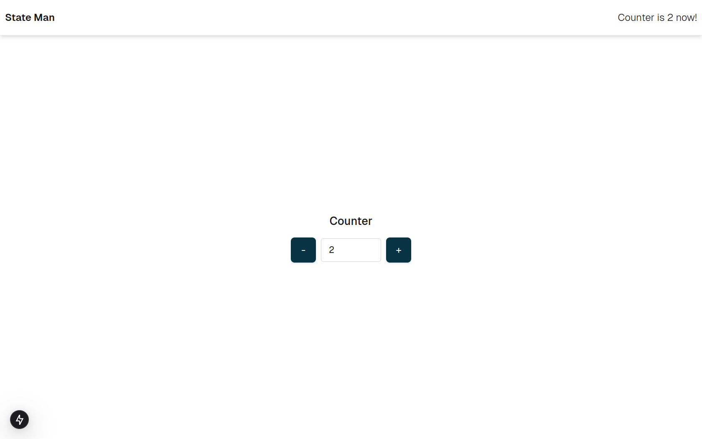

# Next State Man

This repo is to show how to use [@bentoo/state-man](https://www.npmjs.com/package/@bentoo/state-man) in next applications.

## Configuração do Ambiente

#### 1. Clone o repositório:
```sh
git clone https://github.com/manuelbento19/next_stateman.git
```

#### 2. Instale as dependências:
**NPM**
```sh
    npm install
```
**Yarn**
```sh
    yarn add
```
  **Pnpm**
  ```sh
  pnpm install
  ```
#### 3. Rodar a Aplicação:
**NPM**
```sh
    npm run dev
```
**Yarn**
```sh
    yarn dev
```
  **Pnpm**
  ```sh
  pnpm dev
  ```